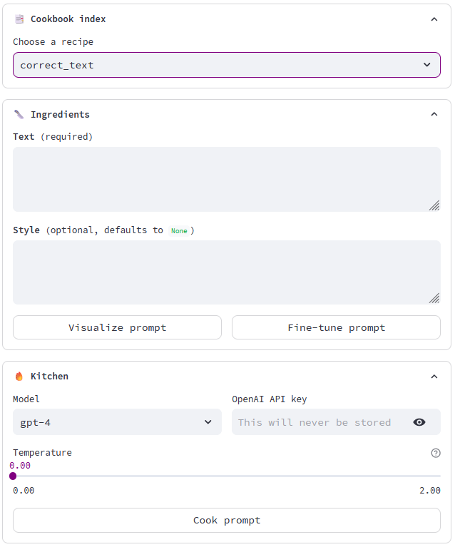

# Promptbook UI

Do you find yourself writing the same kind of prompts again and again into ChatGPT?
Work your most used prompts into a comfy graphic user interface with just a few lines of code.

Promptbook allows you to:
 - Have a customizable UI from a simple prompt-building Python function
 - Store your GUI-prompts to reuse them on a click
 - Use fantastic recipe ideas from other contributors
 
## Examples
For a simple example, the recipe in `recipes/correct_text.py`...
```python
# the recipe: build your prompt with required, default and optional inputs
def correct_text(
        text: str,
        style: str = None
) -> str:
    prompt = f"""
Your task is to correct and improve the text that is shown delimited by quotation marks below.

"{text}"

Output only the corrected text and perform the following actions:
 1. Identify and correct spelling errors
 2. Identify and correct grammatical issues
 3. If necessary, improve readability and reduce verbosity
"""

    if style is not None:
        prompt = prompt + f" 4. Make sure the text is written in {style} style."

    return prompt
```
...will automatically be shown in the app as...



**Promptbook** is built upon Python function signatures and type hints on the inside, mixed up with [Streamlit](www.streamlit.io) at the front end. This allows you to use just plain Python tu build more powerful and highly customizable GUIs for your prompts:


## How to use
**To use the current recipes just get to [Promptbook UI](promptbook.streamlit.app) and start playing!** If you do not have an OpenAI API key to launch the prompts, you can generate them and copy-paste into [ChatGPT](ChatGPT).

To create your own recipes, follow the guide in [`docs/contribute.md`](docs/contribute.md). To learn best practices on prompt engineering, I recommend [this compendium](https://www.promptingguide.ai/introduction/tips).


